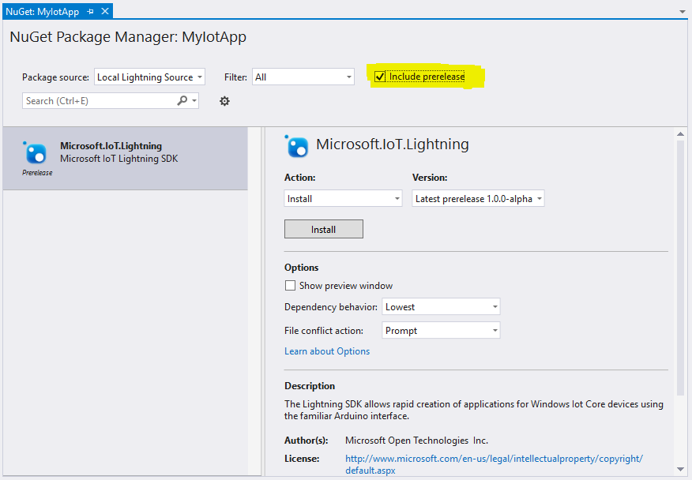
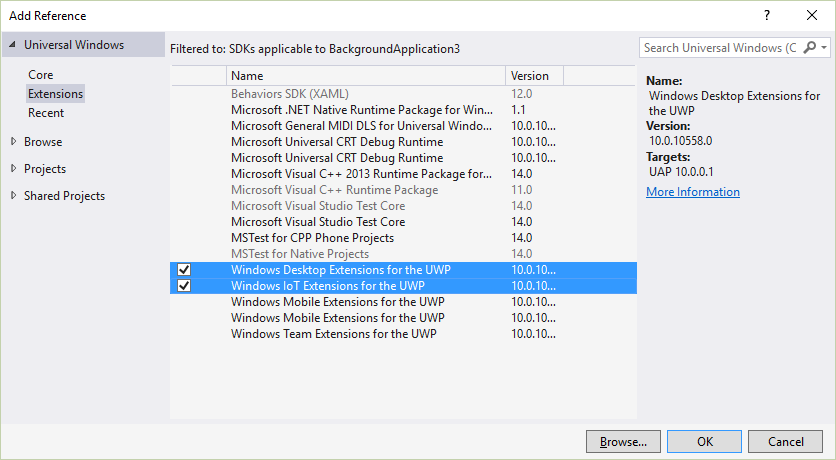

## Microsoft.IoT.Lightning Nuget package
This repository is for generating the Windows Developer Program for IoT Nuget package. This package contains code which is compiled into the maker's application which can be deployed to a board running Microsoft Windows. 

This nuget package depends on Microsoft.IoT.SDKFromArduino, which contains source files written by the Arduino community. Together these packages ensure compatibility with existing sketches running on Microsoft Windows.

##Build the Nuget package
Please download the Nuget command line utility [nuget.exe](http://nuget.org/nuget.exe) into the lightning and arduino-sdk .\source folders.
Run the Nuget package builder from the .\source folder:

~~~
build-nupkg.cmd
~~~

###Nuget Package sources

In order to install nuget packages from your local builds, you'll need to add both the lightning nuget and arduino-sdk to the nuget package manager sources. Following the below instructions for each sdk source:

For Visual Studio Express, nativate to *Tools -> Nuget Package Manager -> Package Manager Settings*
For Other editions of Visual Studio, nativate to *Tools -> Library Package Manager -> Package Manager Settings*


1. Click the "+" button to add a new source
1. Set the name to something descriptive
1. Click the "..." button and navigate to your local sources directory (.\source folder)
1. Click the "Update" button to save the Package Sources changes

###Nuget Package Manager

In order to install prerelease (current) version of Lighning as well as receive prerelease updates to the Lightning package, make sure to set the "Include prerelease" option in the Nuget Package Manager.



1. Right click References in your project
1. Click "Manager Nuget Packages..."
1. Select package sources for Lightning nuget
1. Click "Include prerelease".
1. Click "Install" to install the nuget package to your project

###Add required UWP Extensions

The IOT and Desktop UWP SDK Extensions are both required for building Lightning applications.



1. Right click "References" in your Visual C++ UWP Project
1. Choose "Add Reference..."
1. Open Universal Windows | Extensions
1. Choose Both "Windows Desktop Extensions for the UWP" and "Windows IoT Extensions for the UWP".

###Update Application Package manifest

Also, you need to update the Application Package manifest manually to reference the DMAP device interface.


1. Right click "Package.appxmanifest" in your Visual C++ UWP Project
2. Click "Open With.."
3. In the "Open With" dialog box, choose XML (Text) Editor and click OK
4. Edit the the Capabilities section in your application to add the following:
```XML
<iot:Capability Name="lowLevelDevices" />
<DeviceCapability Name="109b86ad-f53d-4b76-aa5f-821e2ddf2141"/>
```
5. The first is a capability that will enable the application to access custom devices.
6. The second is the device guid id for the DMAP interface
7. Save the file

Build your project to verify all prerequisites to use Lightning were successfully added.
